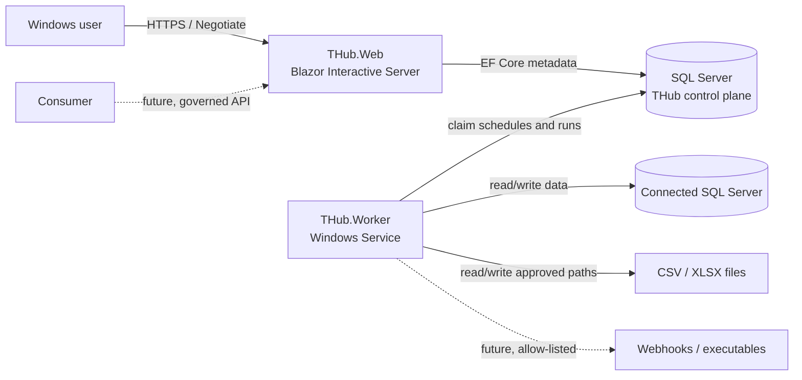
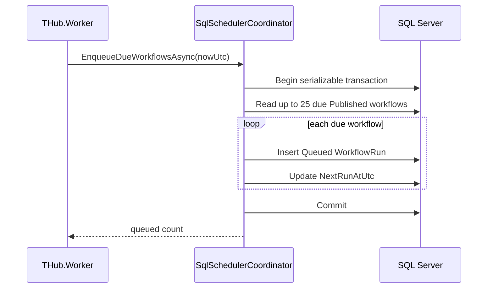

# THub architecture

## 1. Purpose and scope

THub is a Windows/intranet-oriented data workflow orchestration platform. Users design and manage directed workflows in a Blazor application; an out-of-process worker schedules and, in the target architecture, executes them. Microsoft SQL Server is both a supported v1 data connector and the durable THub control-plane store.

The v1 connector boundary is:

- Microsoft SQL Server;
- local or service-accessible CSV files;
- local or service-accessible `.xlsx`/`.xlsm` workbooks.

Webhook calls, external executables, generated REST APIs, and permissioned online table editors are product requirements, but their execution/publication runtimes are intentionally gated until the security decisions in [product-decisions.md](product-decisions.md) are resolved.

## 2. Current, foundation, and target state

| Area | Current implementation | Target direction |
| --- | --- | --- |
| Web | Global Interactive Server Blazor app, Radzen shell, Windows auth/RBAC, in-memory designer | Persisted designer, schema mapping, management APIs, live run views |
| Worker | Windows Service host, validated polling options, durable schedule enqueue | Run leasing, graph execution, retries, cancellation, telemetry |
| Database | `thub` schema for workflows, runs, and connections | Immutable workflow versions, step runs, leases, audit, publications, secrets references |
| Connectors | Node kinds and library dependencies | Streaming SQL/CSV/XLSX readers and writers |
| Publications | UI/graph concepts only | Governed REST endpoints and audited editor surfaces |

“Target” entries are not claims of implemented functionality.

## 3. Architectural drivers

- **Durability:** schedules and run intent must survive web recycling and worker restarts.
- **Windows integration:** authentication and service execution must fit AD-backed intranet deployments.
- **Least privilege:** users, web hosts, workers, source databases, file locations, and published APIs have distinct trust boundaries.
- **Extensibility:** new node types and connectors should not force framework dependencies into the domain.
- **Operability:** runs need stable identities, structured logs, health information, and eventual step-level telemetry.
- **Large-data safety:** execution should stream bounded batches instead of loading complete datasets into Blazor circuits or process memory.
- **Honest versioning:** a run must execute a stable published workflow version, not a mutable draft.

## 4. System context and containers



### THub.Web

Responsibilities:

- authenticate Windows users;
- enforce permission policies at UI and endpoint boundaries;
- render the Blazor/Radzen management experience;
- accept and validate workflow-management commands;
- persist metadata through application/infrastructure services;
- expose internal health/runtime endpoints and, later, governed publication endpoints.

The web host must not execute long-running workflows or own durable schedules. Interactive Server circuits are a presentation mechanism, not a job queue.

### THub.Worker

Responsibilities now:

- run under the .NET Generic Host as a Windows Service;
- validate scheduler configuration at startup;
- poll for due published workflows;
- enqueue run records and advance schedules within a SQL transaction;
- log structured success and failure information.

Target responsibilities:

- lease queued runs safely across one or more worker instances;
- execute validated, immutable workflow versions;
- apply retries, timeouts, cancellation, resource limits, and connector policies;
- record step/run telemetry and checkpoints.

### SQL Server control plane

The `thub` schema is the durable boundary shared by the web and worker processes. It currently stores workflow definitions, workflow runs, and connection metadata. SQL retry behavior is configured through EF Core, and `IDbContextFactory<THubDbContext>` is used because Blazor circuits and singleton background services do not share normal request-scoped lifetimes.

SQL Server is not used as a generic blob store for file contents or run logs without a deliberate later decision.

## 5. Code boundaries and dependency rules

```text
THub.Web ---------+
                  +--> THub.Infrastructure --> THub.Application --> THub.Domain
THub.Worker ------+             |                    |
                                +--------------------+
```

| Project | Allowed responsibilities | Must not contain |
| --- | --- | --- |
| `THub.Domain` | Entities, value types, graph contracts, invariants | EF Core, ASP.NET Core, Radzen, file/network I/O |
| `THub.Application` | Use cases, ports/interfaces, validation, scheduling calculations | UI components, concrete SQL/file implementations |
| `THub.Infrastructure` | EF Core, SQL Server, connector and operating-system adapters | Blazor page logic, authorization UI decisions |
| `THub.Web` | Composition root, components, HTTP endpoints, authentication/authorization | Long-running execution or direct connector logic |
| `THub.Worker` | Composition root, hosted-service lifecycle, operational loop | Workflow business rules duplicated from Application/Domain |

Dependency injection is registered through `AddApplication` and `AddInfrastructure`. Keep `Program.cs` focused on host and pipeline composition.

## 6. Workflow model

A workflow graph is a directed acyclic graph (DAG):

- `WorkflowNode` has a stable string ID, node kind, display name, canvas coordinates, and JSON settings;
- `WorkflowEdge` connects node IDs;
- `WorkflowGraphValidator` rejects missing/duplicate IDs, missing endpoints, self-edges, and cycles;
- `WorkflowDefinition` tracks status, version, graph JSON, owner, cron expression, time zone, and next due time;
- editing a graph increments the version and returns it to Draft;
- publishing makes a workflow eligible for scheduling.

The current table stores `GraphJson` on the workflow row. Before execution is implemented, define and version a JSON schema and separate mutable workflow identity from immutable published versions. This requirement is captured in [ADR-0005](adr/0005-versioned-dag-workflow-model.md).

## 7. Scheduling flow



Current safety: the serializable transaction prevents duplicate schedule enqueueing from concurrent scheduler ticks under the current model.

Required before scale-out execution:

- explicit run lease owner and lease expiry;
- optimistic concurrency token or atomic claim statement;
- recovery of abandoned leases;
- idempotency/retry semantics;
- defined misfire behavior for schedules missed during downtime.

## 8. Data execution architecture

The execution engine should use a bounded tabular stream contract. A conceptual contract has:

- a schema describing names, logical types, nullability, and source metadata;
- asynchronous batches or rows with cancellation;
- explicit ownership/disposal of streams and temporary resources;
- checkpoint metadata where a connector supports incremental processing.

Avoid `DataTable` as a cross-layer or whole-workflow contract. Joins, sorts, and aggregations that exceed configured memory require SQL pushdown or controlled staging/spill behavior.

Planned connector policies:

- **SQL source/target:** parameterized values, allow-listed object identifiers, bounded reads, bulk-copy batches, and explicit insert/merge/replace semantics;
- **CSV:** streaming reads, explicit encoding/delimiter/quote/header settings, row/field limits;
- **Excel:** bounded sheet or named-range reads for `.xlsx`/`.xlsm`; no legacy `.xls` assumption;
- **Webhook:** `IHttpClientFactory`, allow-listed schemes/hosts, timeouts, response limits, and secret-reference headers;
- **Executable:** disabled by default; admin allow-list for executable path, argument template, working directory, identity, timeout, and output limits.

## 9. Security and trust boundaries

### Authentication

Normal hosting uses ASP.NET Core Negotiate. The application is intended for an intranet where clients and servers can authenticate through Windows/AD. The optional development handler is accepted only when:

- the ASP.NET Core environment is `Development`;
- `Authentication:DevelopmentBypass` is explicitly true;
- the request is loopback.

It is a test aid, never a deployment mode.

### Authorization

Authorization is permission-based. Windows groups map to application roles, and roles grant named permissions. A fallback policy requires authentication. Server endpoints and privileged operations must enforce policies even when navigation is hidden with `AuthorizeView`.

Current permissions cover workflow view/edit/execute, schedule management, connection management, publication management, and administration.

### Secrets and untrusted configuration

- Persist secret references, not credentials, inside connection or node JSON.
- Resolve secrets only at the execution boundary and under the worker identity.
- Treat all workflow JSON as untrusted, even when authored by an authenticated designer.
- Never interpolate user-provided SQL identifiers or fragments without validation/allow-listing.
- Canonicalize and validate file paths against configured roots.
- Protect generated publication routes with explicit authentication, authorization, row/column policies, rate limits, and audit records.

### Service identities

The web and worker should use different service identities when practical. The worker identity receives least-privilege access to THub metadata, configured source/target databases, approved directories, and no interactive logon.

## 10. Persistence

Current tables in schema `thub`:

| Table | Purpose | Important indexes/constraints |
| --- | --- | --- |
| `Workflows` | Mutable workflow metadata and current graph JSON | status + next-run, name |
| `WorkflowRuns` | Queued and eventual execution instances | status + queued time; restricted workflow FK |
| `Connections` | Connector metadata JSON | unique name |

Migrations live in `src/THub.Infrastructure/Persistence/Migrations`. Production deployment must apply reviewed migrations as a separate deployment step; web/worker startup should not silently mutate the schema.

## 11. Availability, concurrency, and scale

- The web host is stateless for durable data but Interactive Server circuits are process-bound. Multi-instance web deployment requires sticky sessions or an appropriate Blazor scale-out plan plus shared Data Protection keys.
- The worker catches scheduler errors, logs them, and retries after the configured delay.
- EF Core SQL Server retry-on-failure is enabled for transient database faults.
- The current serializable scheduling transaction is appropriate for the foundation, but run execution needs leases before multiple workers are enabled.
- File connectors are constrained by worker-local or service-accessible paths; moving workers changes file locality and permissions.

## 12. Observability and operations

Implemented:

- structured `ILogger` messages from the worker;
- a basic unauthenticated `/healthz` process health endpoint;
- an authorized `/api/v1/runtime/status` endpoint.

Required before production:

- separate liveness and readiness checks, including SQL readiness;
- correlation IDs across workflow, run, and step records;
- structured step/run logs with redaction;
- duration, throughput, failure, retry, queue-depth, and schedule-lag metrics;
- audit records for workflow publication, connection changes, role configuration, generated APIs, and editor writes;
- retention policies for logs, runs, staging data, and exports.

The current `/healthz` endpoint proves only that the web process is responding; it does not prove SQL Server or the worker is healthy.

## 13. Deployment

Recommended initial topology:

- `THub.Web` behind IIS with Windows Authentication and HTTPS;
- `THub.Worker` installed as an automatic Windows Service;
- SQL Server on a managed internal instance;
- AD groups for application roles;
- a dedicated non-interactive domain service account for the worker;
- connector files beneath configured roots or explicitly approved UNC shares.

The exact topology, Kerberos/SPN requirements, and service-account model remain an open product/deployment decision.

## 14. Testing strategy

- Domain tests cover aggregate behavior and invariants.
- Application tests cover graph validation and cron calculation.
- Add SQL integration tests for EF mappings, transactions, scheduling concurrency, and future run leasing.
- Add `WebApplicationFactory` tests for auth/policy/endpoint wiring.
- Keep Playwright checks for critical designer and management flows, using the loopback development identity only.
- Add connector contract tests with representative encodings, schemas, nulls, large batches, and cancellation.

## 15. Evolution plan

1. Persist designer graphs; introduce immutable published workflow versions and JSON schema versioning.
2. Add SQL schema discovery and a source-to-target mapping experience.
3. Implement run leasing and the execution engine with SQL/CSV/XLSX nodes.
4. Add step telemetry, retries, cancellation, checkpointing, and live run views.
5. Implement import/export with format versioning and secret redaction.
6. Implement governed REST publications.
7. Implement the audited, permissioned online data editor.

Architecture changes must be captured by a new or superseding ADR and reflected here.
