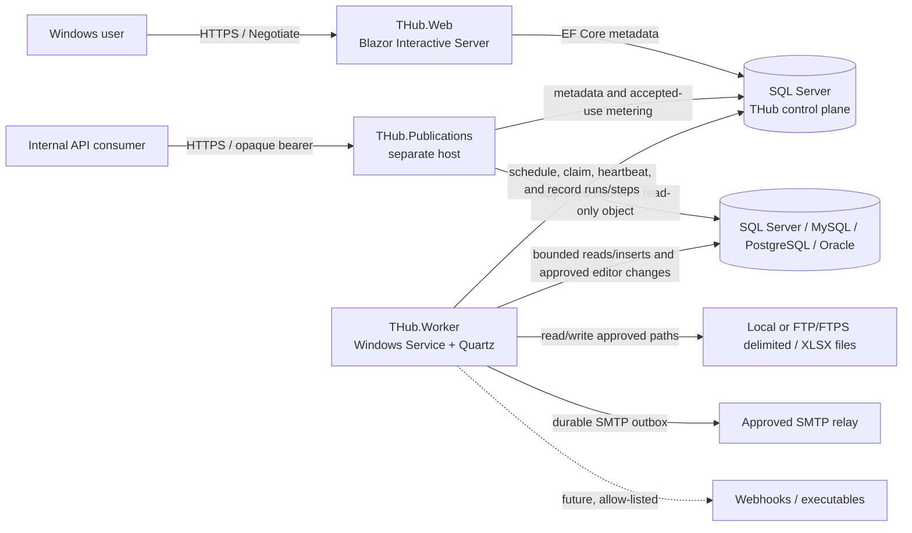

# THub architecture

## 1. Purpose and scope

THub is a Windows/intranet-oriented data workflow orchestration platform. Users persist and manage directed workflows in a Blazor application; an out-of-process Worker schedules and executes their immutable published versions. Microsoft SQL Server is both a supported data connector and the durable THub control-plane store.

The workflow connector boundary is:

- Microsoft SQL Server;
- MySQL, PostgreSQL, and Oracle Database;
- local or service-accessible CSV files;
- local or service-accessible `.xlsx`/`.xlsm` workbooks;
- FTP or FTPS CSV, tab-delimited, and modern Excel files.

Webhook calls and external executables remain gated. Durable Email profiles, workflow-event rules, canvas actions, SQL outbox persistence, leased dispatch, MailKit SMTP delivery, and the management UI implement [ADR-0012](adr/0012-durable-email-alert-delivery.md). The initial internal, single-host publication and staged-editor slice implements [ADR-0011](adr/0011-isolated-governed-data-publications.md): it includes durable publication metadata, a separate managed-bearer REST host, bounded SQL reads, role-granted Spreadsheet editing, and worker-applied approved change sets. Immutable versioning and leased workflow execution implement [ADR-0010](adr/0010-durable-leased-workflow-execution.md), with the current node/runtime limits described below.

## 2. Current, foundation, and target state

| Area | Current implementation | Target direction |
| --- | --- | --- |
| Web | Global Interactive Server Blazor app, Radzen shell, Windows auth/RBAC, persisted workflow catalog/designer with live relational schema mapping, run controls/history, publication administration, and bounded staged Spreadsheet editor | Complete audit/retention and deeper live-run telemetry |
| Publications host | Separate managed-bearer ASP.NET Core host with bounded read-only `/schema` and `/rows` routes, atomic accepted-use metering, process-local admission, Problem Details, logging, and `/healthz` | SQL readiness/metrics and a gateway or distributed limiter before scale-out |
| Worker | Windows Service host, persistent Quartz scheduling, atomic run claims/heartbeats/recovery, bounded graph execution, durable step attempts, Email-outbox dispatch, and claimed approved editor apply | Checkpoint/resume decisions, optional bounded spill, and expanded telemetry |
| Database | `thub` control-plane schema including immutable workflow versions, leased runs/step attempts, Email, and publication versions/tokens/grants/change sets plus `quartz` operational scheduler schema | Expanded audit/retention |
| Connectors | Bounded SQL Server/MySQL/PostgreSQL/Oracle sources and insert targets, local and FTP/FTPS delimited/Excel sources and create-new targets, transforms, and Email action | Live interoperability matrix, richer mapping, explicitly governed operations, and optional pushdown/spill |
| Publications | Governed immutable REST versions, managed tokens/counters, SQL discovery/readers, role grants, Spreadsheet staging/review, and leased apply | Production readiness, live relational/browser coverage, retention, and multi-host admission decision |
| Email alerts | Durable workflow-event and canvas-action outbox delivery through governed SMTP profiles, with administrator management, a redacted delivery monitor, and MailKit sender | Approved production secret-provider integration and a reviewed dead-letter recovery operation |

“Target” entries are not claims of implemented functionality.

## 3. Architectural drivers

- **Durability:** schedules and run intent must survive web recycling and worker restarts.
- **Windows integration:** authentication and service execution must fit AD-backed intranet deployments.
- **Least privilege:** users, web hosts, workers, source databases, file locations, and published APIs have distinct trust boundaries.
- **Extensibility:** new node types and connectors should not force framework dependencies into the domain.
- **Operability:** runs have stable identities and durable step attempts; production still needs richer metrics, readiness, correlation, and retention.
- **Large-data safety:** connectors use bounded batches, while replayable intermediate outputs are materialized only within explicit Worker row/byte/memory limits and never in Blazor circuits.
- **Honest versioning:** a run must execute a stable published workflow version, not a mutable draft.

## 4. System context and containers



### THub.Web

Responsibilities:

- authenticate Windows users;
- enforce permission policies at UI and endpoint boundaries;
- render the Blazor/Radzen management experience;
- accept and validate workflow-management commands;
- persist metadata through application/infrastructure services;
- manage publication definitions, immutable versions, tokens, grants, staged edits, and approvals;
- host the bounded Radzen Spreadsheet editor and governed foreign-key lookups;
- expose internal health/runtime endpoints.

The web host must not expose bearer publication routes, apply source writes, execute long-running workflows, or own durable schedules. Interactive Server circuits are a presentation mechanism, not a job queue.

### THub.Publications

Responsibilities:

- run as a separate ASP.NET Core process and accept only internal-network publication traffic through its dedicated HTTPS hostname;
- require exactly one managed opaque bearer credential on each `/api/v1/publications/{slug}/schema` or `/rows` request and bind it to the immutable active REST version;
- apply process-local request/concurrency admission, then atomically record an accepted token use before any source query;
- enforce typed allow-listed filters/sorts, deterministic keyset pagination, schema-fingerprint checks, SQL/request timeouts, cancellation, cell/row/response limits, and Problem Details;
- query only the configured SQL Server table or view through integrated or referenced database authentication with read-only connection intent;
- provide structured request logging, HTTPS/HSTS behavior, and a basic `/healthz` process-liveness endpoint.

The admission partition is one token plus one active version and is process-local. The initial topology therefore remains one publication-host instance; it does not yet provide an aggregate limit across every token for a publication. `/healthz` does not prove control-plane or source SQL readiness, and internet exposure, alternate JWT/Entra authentication, and multi-host scale require a new decision.

### THub.Worker

Responsibilities now:

- run under the .NET Generic Host as a Windows Service;
- validate scheduler configuration at startup;
- reconcile published THub schedules into durable Quartz jobs/triggers;
- enqueue idempotent THub run records when Quartz fires and advance the next occurrence;
- atomically claim queued or abandoned runs, renew their leases, and prevent overlapping active runs for one workflow;
- reload and verify the exact immutable version identity/checksum before executing its validated DAG;
- execute bounded relational, local-file, and FTP/FTPS sources and targets, select/filter/join transforms, and Email actions with cancellation, timeouts, retry-safety policy, and normalized errors;
- persist node attempts, progress counters, skips/failures, durable cancellation, and terminal run state;
- claim and apply approved editor change sets with a least-privilege source-write identity;
- claim and dispatch durable Email outbox rows through approved SMTP profiles;
- log structured success and failure information.

Checkpoint/resume-from-step, disk-backed intermediate spill, and richer operational telemetry are not implemented. An expired run lease is recovered by executing the immutable graph again from its beginning, so ambiguous external effects remain at-least-once.

### SQL Server control plane

The `thub` schema is the durable product boundary shared by the web, Worker, and publication processes. It stores workflow drafts, immutable workflow versions, leased runs and step attempts, connection metadata, Email delivery profiles/rules/outbox, and publication definitions, immutable versions/columns/foreign keys, role grants, bearer verifier/counter metadata, and staged changes. The `quartz` schema stores Quartz jobs, triggers, cluster check-ins, and locks; application code accesses it only through Quartz APIs. SQL retry behavior is configured through EF Core, and `IDbContextFactory<THubDbContext>` is used because Blazor circuits and long-lived host operations do not share normal request-scoped lifetimes.

Development/debugging uses the `THub.Debug` database on SQL Server LocalDB. Published environments use a separately provisioned SQL Server connection supplied through deployment configuration. Both use the same EF Core SQL Server provider and migrations; Development configuration is excluded from publish output.

### Scheduler ownership boundary

| Concern | Authoritative owner | Notes |
| --- | --- | --- |
| Workflow status, version, cron text, time zone, and `NextRunAtUtc` | THub (`thub.Workflows`) | Revalidated whenever a trigger fires |
| Next-fire timing, misfires, scheduler locks, and cluster check-ins | Quartz (`quartz.QRTZ_*`) | Accessed only through Quartz APIs |
| Logical occurrence identity | THub run plus Quartz trigger metadata | Stored as `ScheduledForUtc` and protected by a THub unique index |
| Run lifecycle and execution result | THub (`thub.WorkflowRuns`) | Quartz does not represent or update workflow execution state |
| Run lease, cancellation, and step lifecycle/retries | THub (`thub.WorkflowRuns`, `thub.WorkflowStepRuns`) | Must not be moved into Quartz jobs or trigger state |

Quartz job/trigger data are deliberately references, not execution payloads. The firing job calls an Application port, which reloads the workflow, checks that the expected version is still published, and creates the THub-owned run. This prevents persisted Quartz state from bypassing product rules after a workflow is edited or paused.

SQL Server is not used as a generic blob store for file contents or run logs without a deliberate later decision.

## 5. Code boundaries and dependency rules

```text
THub.Web ----------+
THub.Publications --+--> THub.Infrastructure --> THub.Application --> THub.Domain
THub.Worker --------+             |                    |
                                  +--------------------+
```

| Project | Allowed responsibilities | Must not contain |
| --- | --- | --- |
| `THub.Domain` | Entities, value types, graph contracts, invariants | EF Core, ASP.NET Core, Radzen, file/network I/O |
| `THub.Application` | Use cases, ports/interfaces, validation, scheduling calculations | UI components, concrete SQL/file implementations |
| `THub.Infrastructure` | EF Core, SQL Server, connector and operating-system adapters | Blazor page logic, authorization UI decisions |
| `THub.Web` | Composition root, components, HTTP endpoints, authentication/authorization | Long-running execution or direct connector logic |
| `THub.Publications` | Bearer/API composition root and API transport concerns | Management UI, Windows-authenticated operations, direct business rules, source writes |
| `THub.Worker` | Composition root, hosted-service lifecycle, operational loop | Workflow business rules duplicated from Application/Domain |

Dependency injection uses explicit host profiles: `AddWebApplication`/`AddWebInfrastructure`,
`AddWorkerApplication`/`AddWorkerInfrastructure`, and
`AddPublicationApiApplication`/`AddPublicationApiInfrastructure`. The publication profile exposes
only its catalog, bearer validation/metering, schema inspection, and source-read path; SMTP,
workflow executors, editor staging/apply, and management adapters are not registered there. Keep
`Program.cs` focused on selecting the host profile and composing its request or worker pipeline.

## 6. Workflow model

A workflow graph is a directed acyclic graph (DAG):

- `WorkflowNode` has a stable string ID, node kind, display name, canvas coordinates, and JSON settings;
- `WorkflowEdge` connects node IDs;
- `WorkflowGraphValidator` rejects missing/duplicate IDs, missing endpoints, self-edges, and cycles;
- `WorkflowDefinition` stores the mutable draft graph, optimistic `DraftRevision`, lifecycle, owner, schedule, and active published-version pointer;
- editing a published graph advances the candidate version and returns the workflow to Draft without mutating the prior immutable snapshot;
- `WorkflowVersion` stores schema-versioned canonical graph JSON, a SHA-256 checksum, publisher, and timestamp;
- publishing validates structure, port cardinality, typed settings, and policy, then writes the snapshot and published pointer transactionally;
- every scheduled, manual, or retry run references the exact immutable version it executes.

Draft `GraphJson` remains on the workflow row for editing, while `WorkflowVersions` holds immutable snapshots. The Worker verifies the deterministic version identity and checksum, deserializes the supported schema envelope, and reruns structural/cardinality/policy validation before any node starts; each executor reparses its strict typed settings immediately before work. Saved drafts may contain incomplete or gated concepts; only a fully valid operational graph can be published.

## 7. Scheduling flow

```mermaid
sequenceDiagram
    participant R as Quartz reconciliation job
    participant Q as Quartz SQL job store
    participant F as Scheduled workflow job
    participant E as THub run enqueuer
    participant DB as SQL Server
    R->>DB: Read published schedules
    R->>Q: Create/update one-shot triggers; remove stale jobs
    Q-->>F: Fire persisted occurrence (including one recovery misfire)
    F->>E: Enqueue(workflow, version, scheduledForUtc)
    E->>DB: Verify published version
    E->>DB: Insert unique Queued WorkflowRun
    E->>DB: Advance NextRunAtUtc
```

Quartz coordinates schedule firing through its clustered SQL job store. THub independently protects run ownership with a filtered unique index on `(WorkflowId, WorkflowVersion, ScheduledForUtc)`. A stale job cannot enqueue after a workflow is paused or changed because the application port revalidates status and version at the firing boundary.

THub retains its five-field cron contract. Cronos calculates the next occurrence, represented as a one-shot Quartz trigger. If the worker was unavailable at that time, Quartz fires the missed occurrence once and THub calculates the following occurrence from the recovery time, avoiding an unbounded catch-up burst.

ADR-0010's execution boundary is implemented: SQL claims record lease owner/expiry/heartbeat/attempt, an application lock plus active-lease check permits one running instance per workflow, cancellation is durable, step/terminal writes require the current lease, and an expired running lease is eligible before new queued work. Read-only sources/transforms retry only normalized transient failures with bounded exponential jitter; SQL/file targets and Email actions do not automatically retry within an execution attempt. Recovery still restarts the graph and may replay an external effect whose outcome was ambiguous, so THub remains at-least-once rather than exactly-once.

## 8. Data execution architecture

The execution engine uses a bounded tabular contract with:

- a schema describing names, logical types, nullability, and source metadata;
- asynchronous batches or rows with cancellation;
- explicit ownership/disposal of batches, streams, workbooks, and temporary files;
- configurable run, node-attempt, row, column, batch-byte, output-byte, and retained-workflow limits.

The current replayable data-set store materializes each bounded node output in Worker memory and releases it after its last consumer. It does not use `DataTable`, spill to disk, checkpoint a partial graph, or resume from a completed step. Configure limits below the service account's memory budget; workflows that require larger joins or global operations need SQL pushdown or a future controlled spill design.

The Web designer resolves relational schema metadata through an Application port and provider-specific Infrastructure adapter. A user selects an approved enabled connection plus schema/object, opens bounded live column metadata, chooses source columns, and configures each writable destination column with a source-column, workflow-variable, or JavaScript-expression binding. Auto-map accepts only equal names with equal logical types. The resulting strict `columns` and `bindings` JSON is still the durable workflow contract; raw JSON is collapsed as an advanced view rather than the primary relational editing experience. Schema inspection does not read row values.

Graph schema version 2 also carries typed non-secret workflow variables and reusable expression-only JavaScript functions. Built-in `runId`, `runStartedAtUtc`, and `utcToday` values are frozen at execution-attempt start. Literal globals are stored in the immutable graph. Database globals resolve once per attempt through an approved relational connection and a quoted object/column plus parameterized equality filter; zero or multiple rows fail. Jint evaluates destination expressions against frozen JSON-shaped `row` and `vars` objects with CLR and dynamic string compilation unavailable and fixed memory, statement, recursion, cancellation, and time constraints. Per-row database enrichment remains a source/join workflow.

Implemented v1 node behavior:

- **Relational source:** SQL Server, MySQL, PostgreSQL, and Oracle nodes validate schema/object/column identifier syntax, discover exact object and column types, apply configured command/batch bounds, and stream selected table/view rows into bounded batches. They accept no arbitrary SQL text or source predicate pushdown.
- **Relational target:** validates/discovers the provider-specific target and uses parameters inside one transaction. Only explicit `insert` is supported; per-column mappings are optional and merge/update/replace/delete are not implied.
- **CSV source/target:** resolves a relative `.csv` path beneath an approved root, enforces file/row/column limits, supports explicit header/delimiter/typed-column settings, and writes only `createNew` through a temporary file followed by a move.
- **Excel source/target:** applies the same approved-root and size/shape bounds to `.xlsx`/`.xlsm`, reads an approved worksheet/range, and writes only a new workbook target.
- **FTP/FTPS source/target:** transfers only an absolute traversal-free remote path after applying connection file/time bounds, then reuses the bounded delimited/Excel parser or writer in a unique Worker temporary directory. Targets are create-new without overwrite. Plain FTP is an explicit unencrypted compatibility mode; FTPS is preferred. SFTP and remote watchers are not implemented.
- **Transforms:** select projects configured columns; filter applies up to 32 typed scalar predicates; inner/left join binds exactly two named incoming nodes and bounds the buffered right side.
- **Email action:** enqueues durable delivery intent through the governed Email profile/outbox boundary; recovered graph attempts reuse its stable run/node deduplication identity.
- **Webhook/executable:** draft concepts exist, but publication validation and execution preflight reject them until ADR-0008 policies and executors exist.
- **REST/editor publication nodes:** intentionally rejected as workflow operations; their implemented lifecycle is the separately governed Publications surface.

Nodes execute in deterministic topological order. A failed/cancelled dependency causes downstream nodes to be durably skipped. `Execution:MaximumConcurrency` bounds concurrently claimed runs, not parallel nodes inside one run.

### Email alerts and actions

ADR-0012 is implemented for both terminal workflow-event rules and the `EmailAlert` action. Administrators manage enabled delivery profiles and per-workflow rules at `/alerts/email`; profiles constrain the relay, required TLS mode, approved sender, recipient domains, recipient/message/concurrency limits, and an optional credential secret reference. Templates use only the bounded workflow/run/error variable allow-list. SQL claim admission holds the profile row while counting unexpired sending leases, enforcing `MaximumConcurrentSends` admission across Worker instances.

Running-run completion or direct queued-run cancellation and the rule deliveries prepared from the immediately preceding policy snapshot commit in one SQL transaction. The commit rechecks the complete set of matching enabled rules plus each prepared rule/profile revision, so concurrent policy changes cause preparation to restart instead of silently omitting an alert. The `EmailAlert` action uses the same outbox and succeeds when durable intent is queued, not when the relay or recipient accepts it. Its stable run/node deduplication identity makes recovered step attempts idempotent at enqueue. Delivery rows carry stable message/deduplication identities and are claimed with a lease by the Worker. The MailKit adapter revalidates the profile policy, requires STARTTLS or implicit TLS, resolves a referenced SMTP credential only at send time, and otherwise connects without SMTP authentication for an administrator-approved anonymous relay.

Known transient and otherwise-unexpected sender failures use bounded exponential backoff with deterministic jitter; permanent failures and deliveries that exhaust their attempt limit become dead letters. Delivery remains at-least-once: a crash after SMTP acceptance but before the delivered transition commits can produce a duplicate. Attempt count, last-attempt time, current/retry state, an optional provider identity, and the bounded safe last error are kept on `AlertDeliveries`; v1 intentionally has no separate attempt-history table. The MailKit adapter currently supplies the stable THub MIME Message-ID but does not populate `ProviderMessageId`. The default `UnavailableSmtpSecretResolver` rejects every credential reference, so authenticated SMTP fails closed until deployment replaces that registration with an organization-approved `ISecretResolver`.

### REST publications and Spreadsheet editors

ADR-0011 separates REST and editor responsibilities:

- `THub.Publications` exposes only internal read-only REST v1 routes based on stable slugs and approved immutable publication metadata. Multiple named opaque bearer tokens are independently expiring/revocable and maintain `AcceptedRequestCount` plus `LastUsedAtUtc`; plaintext is returned only when a token is created.
- `THub.Web` hosts role-governed, bounded Radzen Spreadsheet sessions. View, Insert, Update, Delete, and Approve grants are separate from publication-management permission and are checked by application services for load, lookup, staging, review, and list/detail operations.
- edits are normalized, revalidated, and staged in THub; `THub.Worker` claims only approved sets and applies each set in one source transaction with `rowversion` or explicitly selected original-value concurrency. The Blazor circuit has no source-write identity.
- SQL catalog inspection discovers tables/views, supported typed columns, a primary or safe unfiltered unique key, rowversion metadata, and foreign keys. Display/search candidates are suggestions only; management defaults every lookup to unapproved and persists it only after explicit administrator selection. The active version freezes that policy and its fingerprint. Loaded labels are batch-resolved with bounded parameterized queries, and the bounded searchable `RadzenDropDownDataGrid` editor commits single or atomic composite referenced keys. Staging rechecks tuple existence against the active schema before persisting a change set.
- non-generated key values can be supplied for insert, but keys, generated columns, and concurrency tokens are never update targets. Source uniqueness/foreign-key violations and optimistic-concurrency misses become change-set conflicts.

Change-set apply deliberately does not claim exactly-once cross-database effects. If source commit completion is ambiguous, the stale apply is failed for operator reconciliation instead of automatically replaying a potentially duplicated insert. A general audit stream and before/after retention classification remain open under PD-009.

## 9. Security and trust boundaries

### Authentication

Normal hosting uses ASP.NET Core Negotiate. The application is intended for an intranet where clients and servers can authenticate through Windows/AD. The optional development handler is accepted only when:

- the ASP.NET Core environment is `Development`;
- `Authentication:DevelopmentBypass` is explicitly true;
- the request is loopback.

It is a test aid, never a deployment mode.

The publication API uses a different trust boundary: IIS permits anonymous transport only for the dedicated internal publication hostname, while each ASP.NET Core data endpoint requires exactly one managed opaque bearer credential before admission, metering, or data access. Bearer identities have no management or Spreadsheet authority.

### Authorization

Authorization is permission-based. Windows groups map to application roles, and roles grant named permissions. A fallback policy requires authentication. Server endpoints and privileged operations must enforce policies even when navigation is hidden with `AuthorizeView`.

Current permissions cover workflow view/edit/execute, schedule management, connection management, publication management, and administration.

Workflow removal and package portability follow [ADR-0017](adr/0017-safe-workflow-lifecycle-and-package-portability.md).
`workflow.delete` permits resource-authorized archive and the narrower permanent deletion
of unused drafts. Export emits the current editable definition and non-secret connection
identity hints. Import resolves those hints where possible and always creates a new
unpublished draft; it does not restore immutable versions, run history, or active schedules.

Publication-management permission does not itself grant access to editor data. Each editor publication independently maps SQL-backed system or custom roles to View, Insert, Update, Delete, and Approve capabilities. Application services enforce those grants for load, lookup, submit, review, and change-set queries. Worker apply accepts only an already approved set and revalidates publication/version/schema state, but the current change set does not retain a role snapshot and the worker does not re-evaluate submitter/reviewer grants after approval.

### Secrets and untrusted configuration

- Persist secret references, not credentials, inside connection or node JSON.
- Resolve database authentication through the provider-neutral Application contract from ADR-0013; SQL-specific connection-string construction remains in Infrastructure.
- Resolve secrets only at the execution boundary and under the worker identity.
- Treat all workflow JSON as untrusted, even when authored by an authenticated designer.
- Never interpolate user-provided SQL identifiers or fragments without validation/allow-listing.
- Canonicalize and validate file paths against configured roots.
- Protect publication routes with explicit authentication, approved object/column policy, bounds, and admission limits. Add a fixed row policy before publishing data that is not safe at the full approved row scope.
- Treat token counters and change-set actor/status fields as operational metadata, not as a substitute for the still-pending append-only audit stream.
- Store only a selector, display prefix, algorithm version, and one-way verifier for a managed publication token; return the full token once and never log it.
- Store SMTP credential references rather than secret values and resolve them only inside the Worker dispatcher. The default resolver supports no referenced credential; production authenticated SMTP requires an organization-approved `ISecretResolver`.

### Service identities

Web, Publications, and Worker should use different service identities. Web receives THub management/staging rights and only the source-read rights needed for editor windows/lookups. Publications receives token/metering rights and approved REST source-read rights only. Worker receives least-privilege access to run/outbox/change-set state, configured source/target databases, approved directories/relay, and no interactive logon; it is the only host granted approved editor source-write access.

## 10. Persistence

Current tables in schema `thub`:

| Table | Purpose | Important indexes/constraints |
| --- | --- | --- |
| `Workflows` | Mutable workflow metadata and current graph JSON | status + next-run, name |
| `WorkflowVersions` | Immutable schema-versioned graph snapshot, checksum, publisher, and timestamp | unique workflow + version; restricted workflow FK |
| `WorkflowRuns` | Version-bound queued/running/terminal executions, lease/heartbeat/attempt, cancellation, retry origin, and normalized terminal error | status + queued/lease expiry; unique scheduled occurrence; restricted workflow/version/retry FKs |
| `WorkflowStepRuns` | Durable node attempts, lifecycle, progress counters, and normalized error | unique run + node + attempt; status + queued time |
| `Connections` | Connector metadata JSON | unique name |
| `Publications`, `PublicationVersions`, `PublicationColumns`, `PublicationColumnForeignKeys` | Stable publication identity and immutable approved SQL source/column/FK policy | unique slug/version/alias/ordinal; restricted source-connection/version relationships |
| `PublicationAccessTokens` | Opaque-token selector/verifier, expiry/revocation, accepted count, and last-use metadata | unique binary-collated selector; rowversion concurrency |
| `PublicationGrants` | Per-publication role capabilities | unique publication + role |
| `PublicationChangeSets`, `PublicationChanges` | Staged insert/update/delete review and apply state plus bounded row JSON | status/submission indexes, rowversion, restricted publication/version relationships |

Migrations live in `src/THub.Infrastructure/Persistence/Migrations`. Production deployment must apply reviewed migrations as a separate deployment step; web/worker startup should not silently mutate the schema.

Reviewed mappings and migrations now include immutable workflow versions, run claims/cancellation, step attempts, Email delivery profiles/rules/outbox, and the governed publication tables listed above. Email templates are value objects serialized with their rules, and delivery attempt state is summarized on each delivery rather than stored in a separate attempt-history table. Expanded audit events and retention metadata remain future work.

## 11. Availability, concurrency, and scale

- The web host is stateless for durable data but Interactive Server circuits are process-bound. Multi-instance web deployment requires sticky sessions or an appropriate Blazor scale-out plan plus shared Data Protection keys.
- Quartz retries transient job-store connectivity and persists scheduler/cluster state in SQL Server.
- EF Core SQL Server retry-on-failure is enabled for transient database faults.
- Scheduler and workflow-execution instances can share SQL Server: Quartz coordinates schedule fires, while THub's atomic run claim, per-workflow application lock, active-lease check, and lease-checked writes coordinate execution. Production scale-out still needs representative SQL contention and failure-injection validation.
- File connectors are constrained by worker-local or service-accessible paths; moving workers changes file locality and permissions.
- Initial REST deployment is one `THub.Publications` instance because the accepted built-in rate-limit counters are process-local. Scale-out requires a gateway or distributed-limiter ADR.
- REST versions currently govern object and column exposure but do not add a fixed row-level predicate; publish only objects whose full approved row scope is suitable for every token on that publication.
- Spreadsheet windows are in-memory presentation state, capped at 1,000 rows by ADR-0011; server filtering, deterministic navigation, authorization, and persistence remain authoritative.

## 12. Observability and operations

Implemented:

- Serilog-backed structured `ILogger` messages from all three executable hosts, including rolling JSON files;
- ASP.NET Core request completion logging;
- Quartz persistence, cluster, reconciliation, and scheduled-run events;
- durable run/step lifecycle, retry, cancellation, skip, normalized error, and row/batch/byte progress records;
- a basic unauthenticated `/healthz` process health endpoint;
- an authorized `/api/v1/runtime/status` endpoint;
- a separate publication host with managed-bearer `/schema` and `/rows` routes, Serilog request output, Problem Details, bounded responses, and basic `/healthz` process liveness.

Required before production:

- separate liveness and readiness checks, including SQL readiness;
- correlation IDs across workflow, run, and step records;
- structured step/run logs with redaction;
- duration, throughput, failure, retry, queue-depth, and schedule-lag metrics;
- audit records for workflow publication, connection changes, role configuration, generated APIs, and editor writes;
- publication token accepted-use, rejection, source-query, and schema-drift metrics without token or row payloads;
- Email outbox depth, attempts, age, dead letters, and safe delivery-error categories;
- retention policies for logs, runs, staging data, and exports.

The current Web and Publications `/healthz` endpoints prove only that their respective processes are responding; they do not prove SQL Server, source data, or the worker is healthy.

## 13. Deployment

Recommended initial topology:

- `THub.Web` behind IIS with Windows Authentication and HTTPS;
- one internal-only `THub.Publications` instance behind a separate HTTPS hostname and least-privilege app-pool identity; anonymous IIS transport is enabled only there so ASP.NET Core can validate managed bearer credentials at the data endpoints;
- `THub.Worker` installed as an automatic Windows Service;
- SQL Server on a managed internal instance;
- AD groups for application roles;
- a dedicated non-interactive domain service account for the worker;
- connector files beneath configured roots or explicitly approved UNC shares.

Internet exposure, additional publication instances, alternate JWT/Entra authentication, and direct editor writes are outside the accepted initial topology and require new ADRs. Kerberos/SPN details, production secret storage, and exact service accounts still require deployment-owner confirmation.

## 14. Testing strategy

- Domain tests cover aggregate behavior and invariants.
- Application tests cover graph/settings validation, planning, bounded engine behavior, resource limits, cancellation, retry policy, workflow management, run controls/history, and cron calculation; domain tests cover immutable versions and run/step transitions.
- Worker tests cover stable Quartz identities, persisted occurrence metadata, five-field-cron-to-one-shot-trigger mapping, and execution option bounds.
- Add live SQL Server contention/recovery tests for workflow run claims and lease loss, plus connector contract tests against representative SQL tables and files.
- Web integration tests cover loopback Development authentication and status-code handling; expand them for policy and endpoint wiring as those surfaces grow.
- Current publication-host tests cover generic bearer challenges, query-string rejection, duplicate authorization values, and process-local admission behavior. Application/Infrastructure/Web tests cover token services, query planning, role grants, change validation, natural-key immutability, and Spreadsheet mapping. Live SQL Server integration must still cover cross-publication denial, independent token counts/revocation, fail-closed concurrent metering, schema drift, relational claims/apply, bounds, Problem Details, and rate-limit responses.
- Worker and SQL integration tests must cover concurrent run/change-set/outbox claims, lease expiry/recovery, cancellation, retry classification, deduplication, and ambiguous external outcomes.
- Browser tests must cover role-specific read/edit/approve Spreadsheet behavior, bounds, protected-snapshot comparison, foreign-key lookup editors, and authorization rechecks.
- Keep Playwright checks for critical designer and management flows, using the loopback development identity only.
- Add connector contract tests with representative encodings, schemas, nulls, large batches, and cancellation.

## 15. Evolution plan

1. Add live SQL/file connector and multi-Worker lease/recovery coverage, failure injection, and operator-facing execution metrics/readiness.
2. Decide checkpoint/resume and bounded disk-spill semantics before supporting workflows larger than the current in-memory budgets.
3. Integrate an organization-approved SMTP secret provider and add Email outbox monitoring and operator recovery surfaces.
4. Add publication-host SQL readiness, centralized metrics, live SQL Server/browser coverage, and operator reconciliation for ambiguous editor applies.
5. Resolve publication before/after classification and retention under PD-009; require a new ADR before internet exposure, alternate authentication, direct writes, or multi-host admission.
6. Add complete audit/retention, readiness, and production monitoring; extend the implemented redacted workflow-package format only through explicit schema compatibility.

Architecture changes must be captured by a new or superseding ADR and reflected here.
